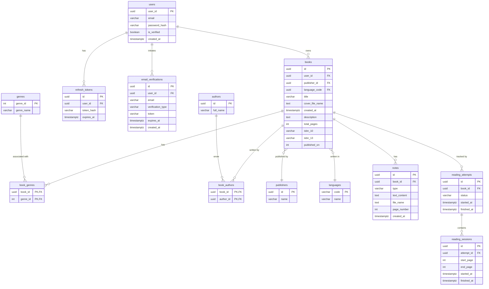
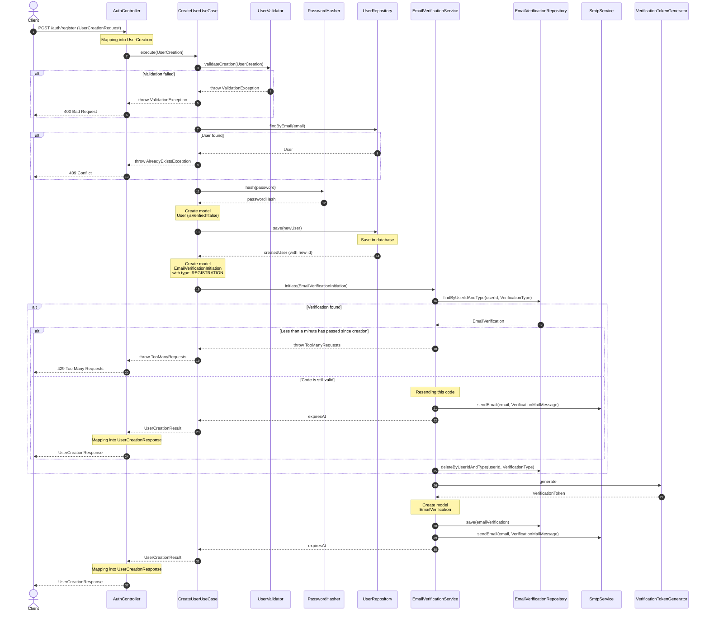
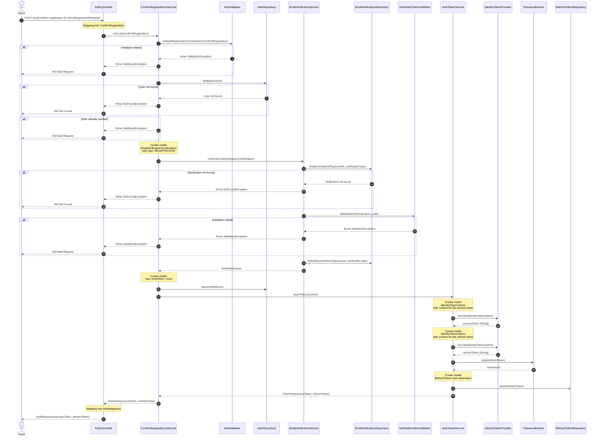
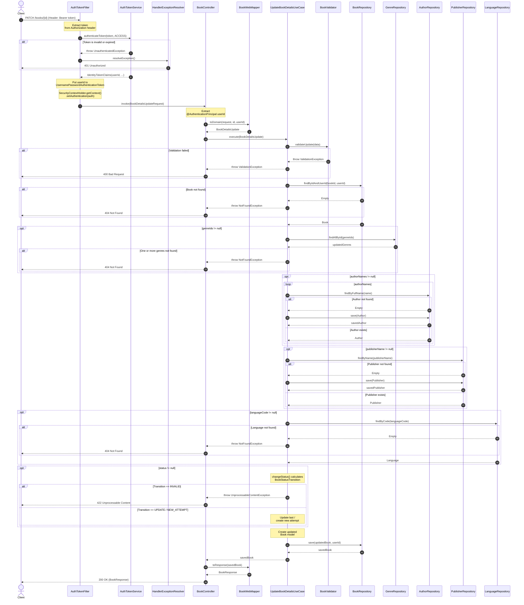

<br>
<p align="center">
  
</p>
<br>

<p align="center">
  <a href="https://opensource.org/licenses/MIT"></a>
  <a href="https://github.com/Nirtas/booktracker-backend/releases/latest"></a>
  <a href="https://hub.docker.com/r/jerael/booktracker-backend"></a>
</p>

[Русская версия](README.ru.md)

# BookTracker

Backend for tracking your reading progress, built with **Clean Architecture** principles. This server manages book data,
genres, users and secure cover storage.

## Tech Stack

- **Framework:** Spring Boot 4 (Java 17)
- **Security:** Spring Security, Argon2id hashing, JWT (Nimbus JOSE + JWT)
- **Database:** PostgreSQL
- **Migrations:** Liquibase (YAML)
- **File Storage:** MinIO (S3 compatible)
- **Documentation:** OpenAPI / Swagger UI
- **Deployment:** Docker & Docker Compose
- **SMTP** for email delivery

## Architecture

The project follows **Clean Architecture** to ensure maintainability and testability:

- **Web:** REST Controllers, DTOs, Security Filters and Web Mappers.
- **Application:** Orchestration of business logic through use cases and domain services.
- **Domain:** Pure business logic, Entities, Repository interfaces and Validation rules.
- **Data:** Infrastructure implementations (JPA Repositories, S3 Storage, Image Processor, Password Hasher, Identity
  Token Provider).
 
## Diagrams

<details>
<summary><b>ER diagram</b></summary>



</details>

<details>
<summary><b>Workflow 1: User registration (without verification)</b></summary>



</details>

<details>
<summary><b>Workflow 2: Email verification</b></summary>



</details>

<details>
<summary><b>Workflow 3: Book details update (without cover)</b></summary>



</details>

## Setup & Development

### Prerequisites

- Docker & Docker Compose
- Java 17+ (for local development)

### Configuration

1. Copy the example environment file:
   ```bash
   cp .env.example .env
   ```
2. Fill in your credentials and properties in the `.env` file (DB, MinIO, Argon2, SMTP, JWT).

### Launch Options

#### 1. Development (Infrastructure only)

Start PostgreSQL and MinIO to run the application from your IDE:

```bash
docker compose -f docker-compose.dev.yml up --build -d
```

#### 2. Production (Full Stack from source)

Build and start all services (App + DB + Storage) in containers:

```bash
docker compose -f docker-compose.prod.yml up --build -d
```

## API Documentation

Once the server is running and Swagger enabled in `.env` file (`ENABLE_SWAGGER_UI=true`), explore the API and test
endpoints via Swagger UI:
`http://localhost:8080/swagger-ui/index.html`

### Quick API Reference

All endpoints are prefixed with `/api/v1`.

| Method     | Endpoint                     | Auth Required | Description              |
|------------|------------------------------|---------------|--------------------------|
| **Auth**   |
| `POST`     | `/auth/register`             | No            | Register new user        |
| `POST`     | `/auth/confirm-registration` | No            | Confirm registration     |
| `POST`     | `/auth/login`                | No            | Login                    |
| `POST`     | `/auth/refresh`              | No            | Refresh tokens           |
| `POST`     | `/auth/logout`               | No            | Logout                   |
| `POST`     | `/auth/resend-code`          | No            | Resend verification code |
| **Users**  |
| `GET`      | `/users/me`                  | **Yes**       | Get current user details |
| **Books**  |
| `GET`      | `/books`                     | **Yes**       | Get user's books         |
| `GET`      | `/books/{id}`                | **Yes**       | Get book by id           |
| `DELETE`   | `/books/{id}`                | **Yes**       | Delete book by id        |
| `PATCH`    | `/books/{id}`                | **Yes**       | Update book details      |
| `POST`     | `/books`                     | **Yes**       | Create book              |
| `POST`     | `/books/{id}/cover`          | **Yes**       | Upload book cover        |
| `DELETE`   | `/books/{id}/cover`          | **Yes**       | Delete book cover        |
| `GET`      | `/books/{id}/cover`          | **Yes**       | Get book cover           |
| **Genres** |
| `GET`      | `/genres`                    | **Yes**       | Get all genres           |
| `GET`      | `/genres/{id}`               | **Yes**       | Get genre by id          |
