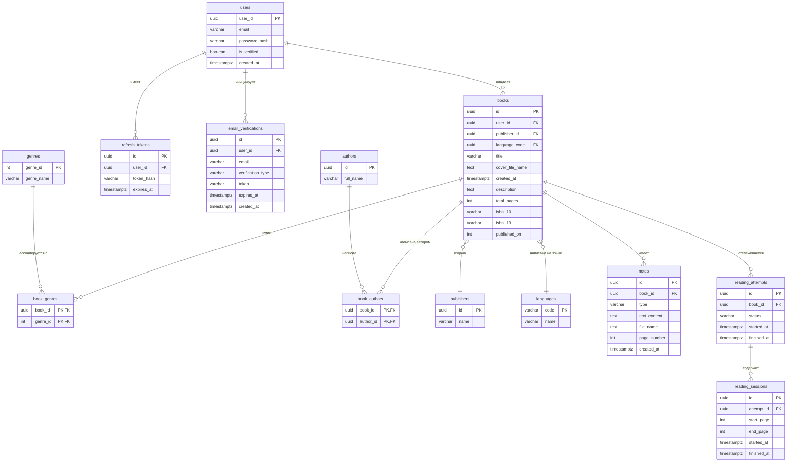
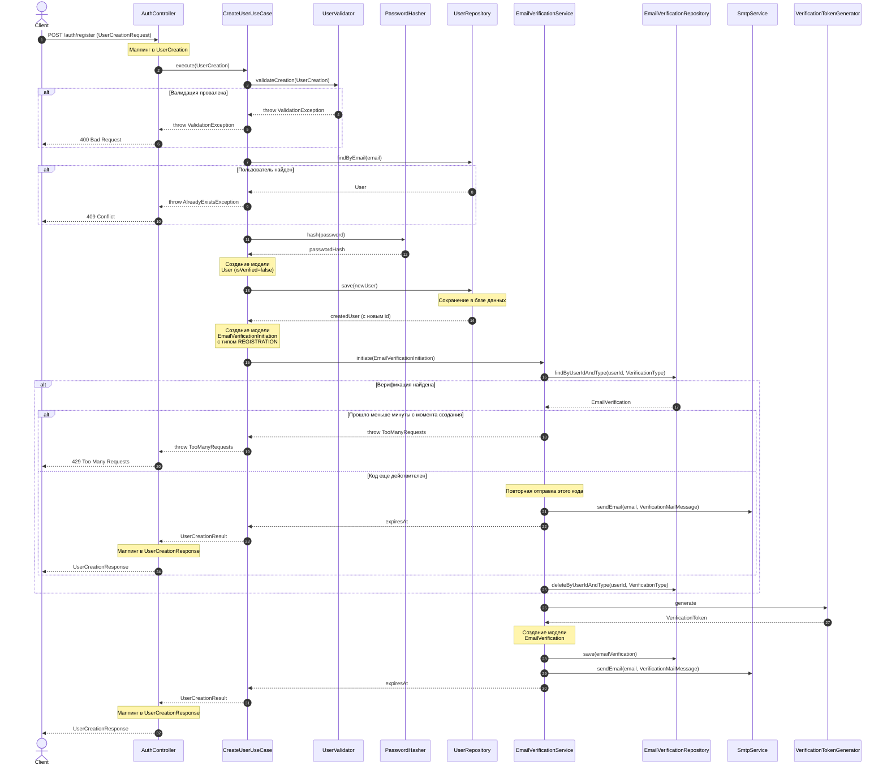
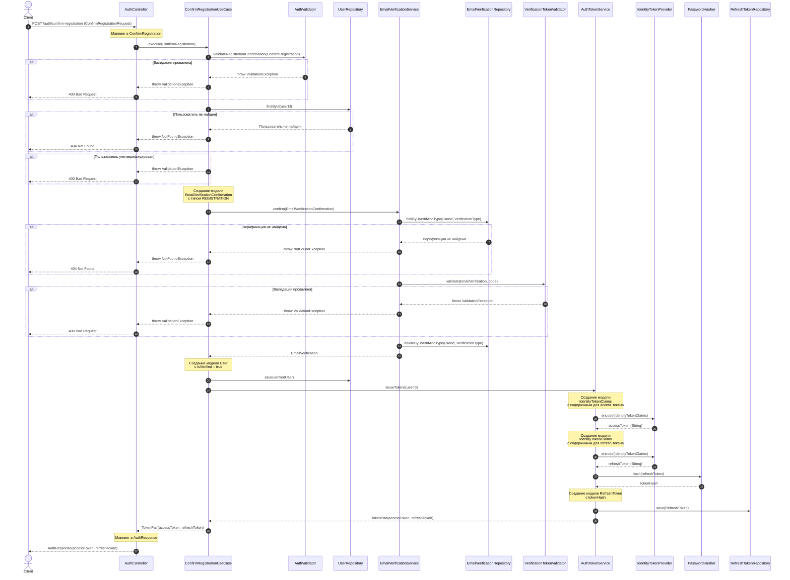
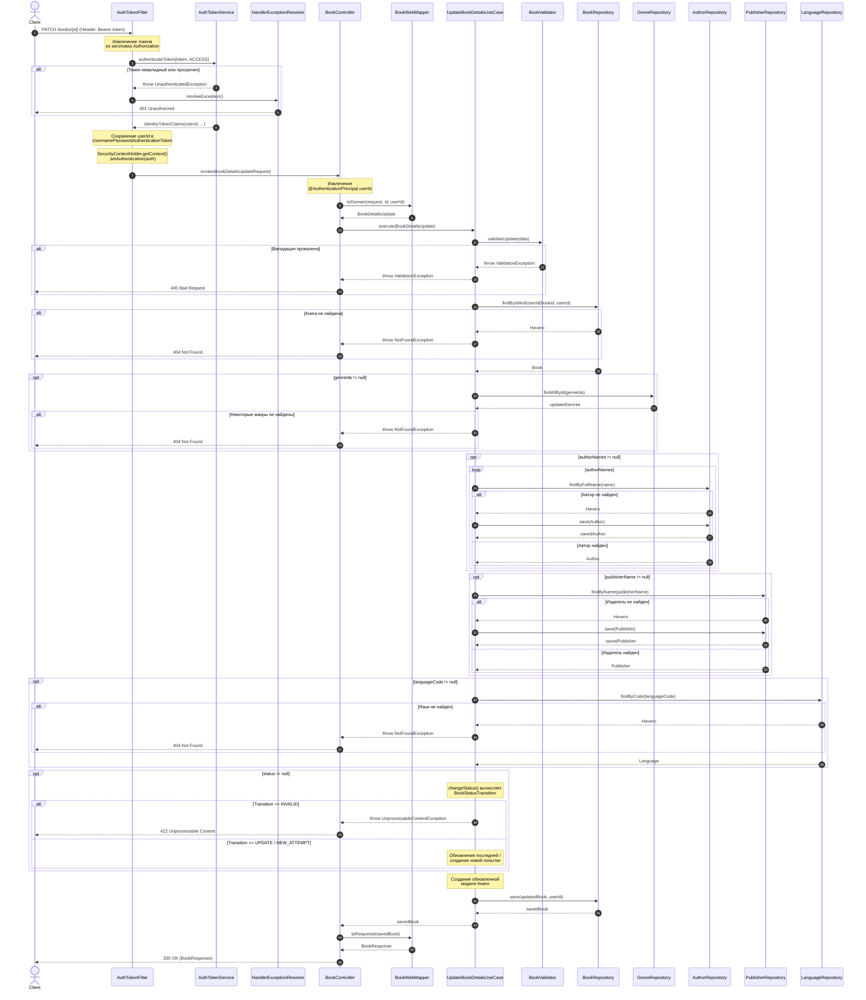
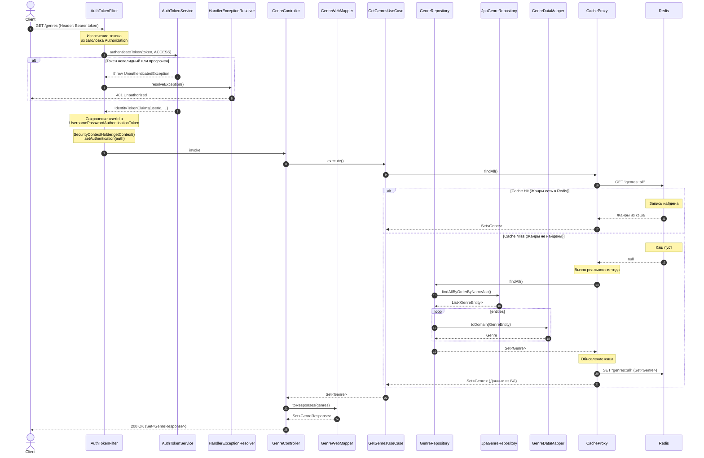

<br>
<p align="center">
  
</p>
<br>

<p align="center">
  <a href="https://opensource.org/licenses/MIT"></a>
  <a href="https://github.com/Nirtas/booktracker-backend/releases/latest"></a>
  <a href="https://hub.docker.com/r/jerael/booktracker-backend"></a>
</p>

[English version](README.md)

# BookTracker

Бэкенд для отслеживания прогресса чтения книг, построенный на принципах **Clean Architecture**. Сервер управляет данными
книг, жанрами, пользователями и обеспечивает безопасное хранение обложек.

## Стек технологий

- **Фреймворк:** Spring Boot 4 (Java 17)
- **Безопасность:** Spring Security, Argon2id hashing, JWT (Nimbus JOSE + JWT)
- **База данных:** PostgreSQL
- **Миграции:** Liquibase (YAML)
- **Хранилище файлов:** MinIO (S3 совместимое)
- **Документация:** OpenAPI / Swagger UI
- **Развертывание:** Docker & Docker Compose
- **SMTP** для доставки электронных писем

## Архитектура

Проект следует принципам **Clean Architecture** для обеспечения расширяемости и тестируемости:

- **Web:** REST контроллеры, DTO, фильтры безопасности и мапперы.
- **Application:** Оркестрация бизнес-логики через юзкейсы и доменные сервисы.
- **Domain:** Чистая бизнес-логика, сущности, интерфейсы репозиториев и правила валидации.
- **Data:** Реализация инфраструктуры (JPA репозитории, S3 хранилище, обработчик изображений, хэшер паролей, поставщик
  токенов идентификации).

## Диаграммы

<details>
<summary><b>ER-диаграмма</b></summary>



</details>

<details>
<summary><b>Сценарий 1: Регистрация пользователя (без верификации)</b></summary>



</details>

<details>
<summary><b>Сценарий 2: Подтверждение почты</b></summary>



</details>

<details>
<summary><b>Сценарий 3: Обновление книги (без обложки)</b></summary>



</details>

<details>
<summary><b>Сценарий 4: Получение списка жанров</b></summary>



</details>

## Настройка и разработка

### Требования

- Docker & Docker Compose
- Java 17+ (для локальной разработки)

### Конфигурация

1. Скопируйте файл с примером переменных окружения:
   ```bash
   cp .env.example .env
   ```
2. Заполните учетные данные и настройки в файле `.env` (БД, MinIO, Argon2, SMTP, JWT).

### Варианты запуска

#### 1. Разработка (только инфраструктура)

Запуск PostgreSQL и MinIO для работы с приложением напрямую из IDE:

```bash
docker compose -f docker-compose.dev.yml up --build -d
```

#### 2. Продакшн (полный запуск из исходников)

Сборка и запуск всех сервисов (Приложение + БД + Хранилище) в контейнерах:

```bash
docker compose -f docker-compose.prod.yml up --build -d
```

## API Документация

После запуска сервера и активации Swagger в `.env` (`ENABLE_SWAGGER_UI=true`), вы можете изучить API и протестировать
эндпоинты через Swagger UI:
`http://localhost:8080/swagger-ui/index.html`

### Краткий справочник по API

Все эндпоинты имеют префикс `/api/v1`.

| Метод              | Эндпоинт                     | Нужна аутентификация | Описание                             |
|--------------------|------------------------------|----------------------|--------------------------------------|
| **Аутентификация** |
| `POST`             | `/auth/register`             | Нет                  | Зарегистрировать нового пользователя |
| `POST`             | `/auth/confirm-registration` | Нет                  | Подтвердить регистрацию              |
| `POST`             | `/auth/login`                | Нет                  | Авторизоваться                       |
| `POST`             | `/auth/refresh`              | Нет                  | Обновить токены доступа              |
| `POST`             | `/auth/logout`               | Нет                  | Выйти                                |
| `POST`             | `/auth/resend-code`          | Нет                  | Повторно отправить код подтверждения |
| **Пользователи**   |
| `GET`              | `/users/me`                  | **Да**               | Получить текущие данные пользователя |
| **Книги**          |
| `GET`              | `/books`                     | **Да**               | Получить все книги пользователя      |
| `GET`              | `/books/{id}`                | **Да**               | Получить книгу по id                 |
| `DELETE`           | `/books/{id}`                | **Да**               | Удалить книгу по id                  |
| `PATCH`            | `/books/{id}`                | **Да**               | Обновить сведения о книге            |
| `POST`             | `/books`                     | **Да**               | Создать книгу                        |
| `POST`             | `/books/{id}/cover`          | **Да**               | Загрузить обложку книги              |
| `DELETE`           | `/books/{id}/cover`          | **Да**               | Удалить обложку книги                |
| `GET`              | `/books/{id}/cover`          | **Да**               | Получить обложку книги               |
| **Жанры**          |
| `GET`              | `/genres`                    | **Да**               | Получить все жанры книг              |
| `GET`              | `/genres/{id}`               | **Да**               | Получить жанр книги по id            |

